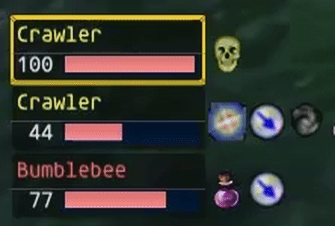
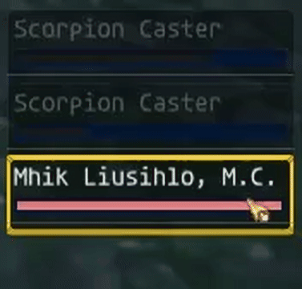
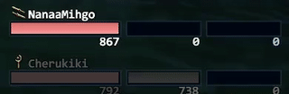
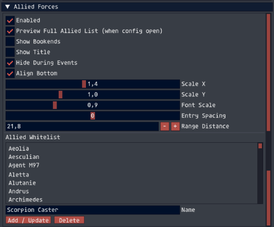
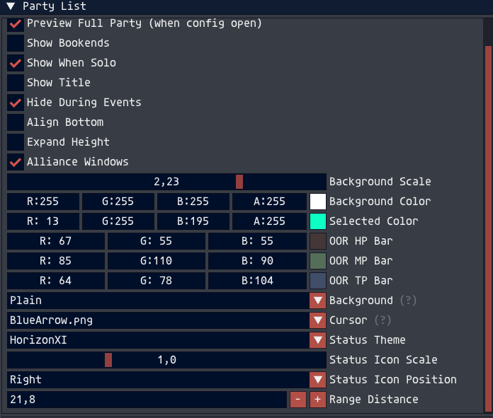

<h2>HXUIPlus</h2>

  HXUIPlus is a Plus fork of <strong>HXUI / XIUI</strong> by tirem. 
  Original project:
  <a href="https://github.com/tirem/XIUI">https://github.com/tirem/XIUI</a>

  HXUIPlus keeps the look and structure of HXUI intact while adding extensive
  quality-of-life improvements focused on
  <strong>interaction, targeting, and support gameplay</strong>.

<h2>Clickable Party and Alliance Targeting</h2>

  Party and alliance list entries are fully clickable with
  <strong>subtarget-safe targeting</strong>, allowing support actions such as Cure,
  buffs, or abilities to be used without dropping your current enemy target.

This eliminates the need for:

<ul>
  <li><code>/stpc</code>-style macros</li>
  <li>Alliance target macros</li>
  <li>Endless tab targeting</li>
</ul>

  Targeting logic correctly respects current target vs subtarget state and avoids
  common in-game errors when performing actions.

<strong>Demo:</strong>

<h2>Enemy List Click Targeting</h2>

  Enemy list entries are fully clickable and reliably target enemies directly from the UI.

  Providing fast and accurate enemy selection during combat.

<strong>Demo:</strong>

<h2>Allied Forces List (New Feature)</h2>

  HXUIPlus introduces a new <strong>Allied Forces list</strong> that displays allied NPC combatants.

<ul>
  <li>NPC whitelist filtering to prevent clutter</li>
  <li>Clickable entries with selection highlighting</li>
  <li>Range-based detection and visual feedback</li>
  <li>Town filtering to prevent population in non-combat zones</li>
  <li>Live config changes without addon reload</li>
</ul>

<strong>Demo:</strong>

<h2>Range-Based Visual Feedback</h2>

  Range detection is configurable and integrated into multiple UI elements.

<h3>Party List</h3>
<ul>
  <li>Name text darkens when out of range</li>
  <li>HP / MP / TP bars darken when out of range</li>
</ul>

<strong>Demo:</strong>

<h3>Enemy List</h3>
<ul>
  <li>Name darkens when out of range</li>
  <li>HP percent text darkens</li>
  <li>HP bar switches to a dark gradient</li>
</ul>

<h3>Target Bar</h3>
<ul>
  <li>Optional setting to darken <strong>only the HP bar</strong> when the target is out of range</li>
</ul>

<strong>Demo:</strong>

<h2>Status Icon Positioning</h2>

  Status icon placement is configurable for both:

<ul>
  <li>Party list</li>
  <li>Enemy list</li>
</ul>

  Icons can be positioned on the left or right, with correct spacing and alignment logic applied automatically.

<h2>Live Configuration Updates</h2>

  Most settings apply immediately without requiring an addon reload, making UI tuning fast and painless.

<h2>Configuration</h2>

  All HXUIPlus settings can be adjusted directly in-game using the configuration menu.

  Open the config at any time with:

<pre><code>/hxuiplus</code></pre>

  Changes apply live and do not require an addon reload.

<h2>New Feature Overview</h2>

<ul>
  <li>Clickable Party list entries with subtarget-safe targeting</li>
  <li>Clickable Alliance list entries with subtarget-safe targeting</li>
  <li>Clickable Enemy list entries with reliable direct targeting</li>
  <li>New Allied Forces list with NPC whitelist filtering</li>
  <li>Hover highlight effects on Party, Enemy, and Allied list entries</li>
  <li>Selected target color customization for Party list entries</li>
  <li>Range-based darkening for names and HP / MP / TP bars</li>
  <li>Selected Range color customization for HP MP TP bars</li>
  <li>Target Bar option to darken HP when target is out of range</li>
  <li>Status icon positioning (left or right) for Party and Enemy lists</li>
  <li>Preview modes for Party and Allied lists when config is open</li>
  <li>Town filtering for Allied Forces list</li>
  <li>Live config changes without addon reload</li>
</ul>

<h2>Upgrading from HXUI / XIUI</h2>

  HXUIPlus is based on the original HXUI / XIUI project and includes automatic settings migration.

  If you are upgrading from an older HXUI or XIUI installation:

<ol>
  <li>Download the latest HXUIPlus release</li>
  <li>Remove the old <code>HXUI</code> or <code>XIUI</code> folder from your addons directory</li>
  <li>Extract the new <code>HXUIPlus</code> folder into your addons directory</li>
  <li>Load the addon in-game with:</li>
</ol>

<pre><code>/addon load hxuiplus</code></pre>

  Your existing settings will be detected and migrated automatically on first load.

  HXUIPlus is designed to feel like <strong>HXUI as you already know it</strong> —
  just smarter, faster, and more playable, especially for support-focused and
  alliance-heavy gameplay.

